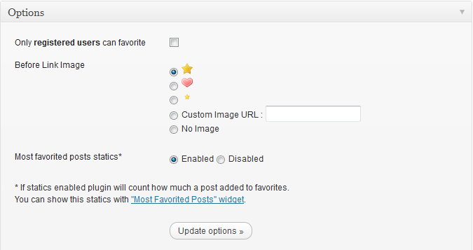
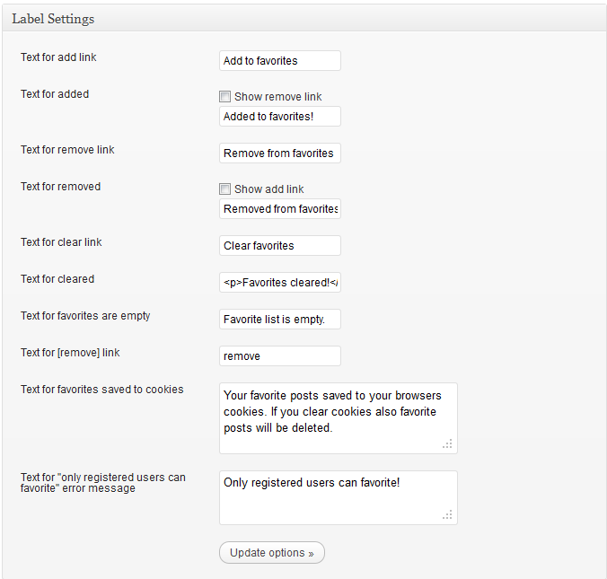
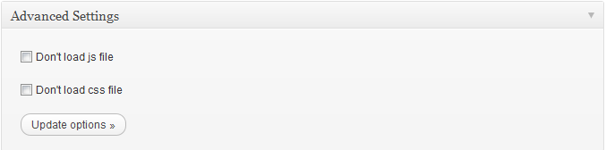
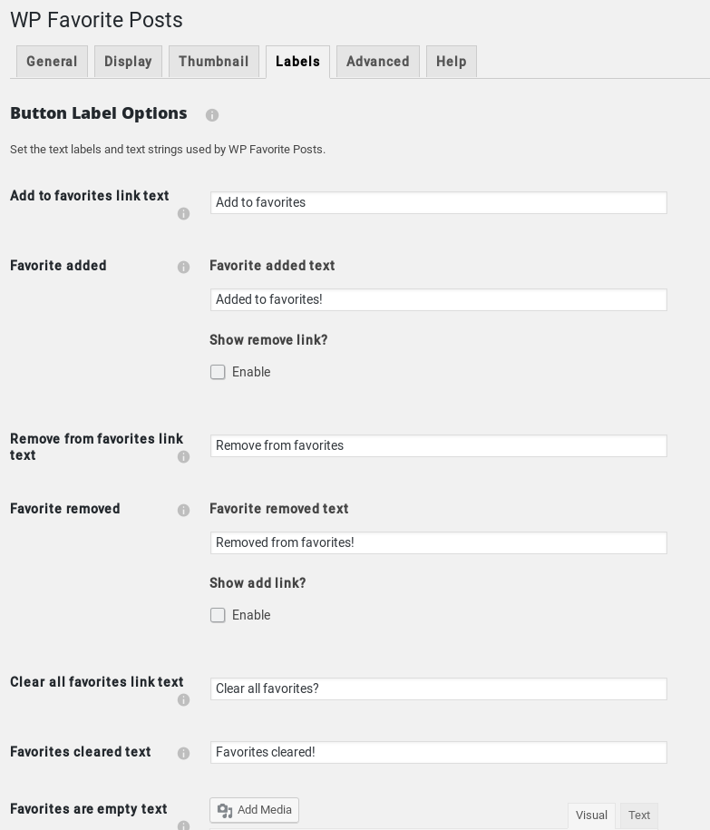
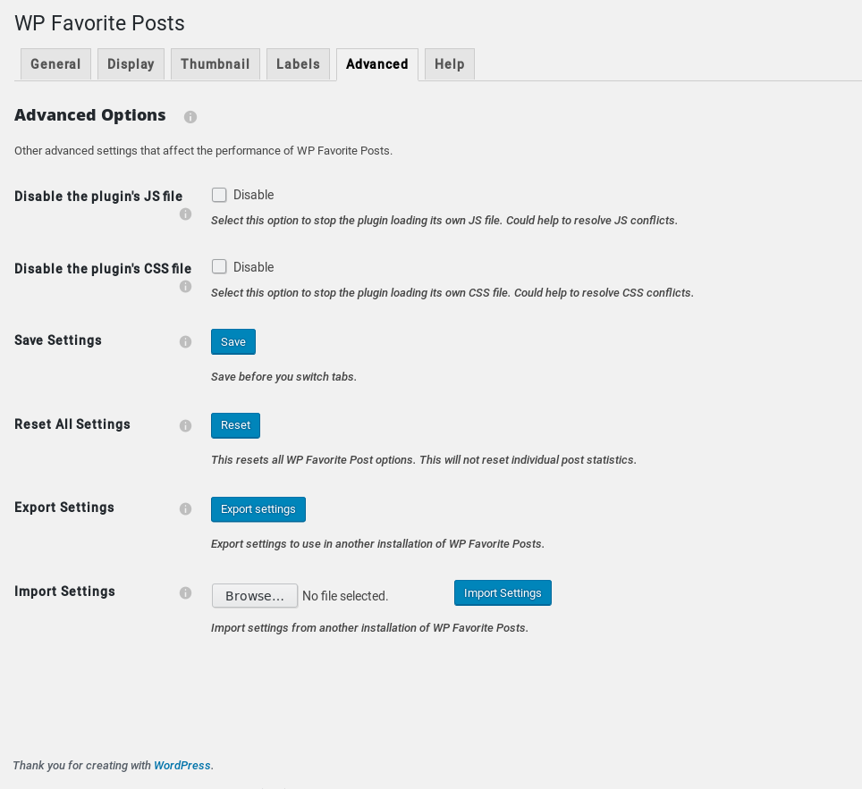
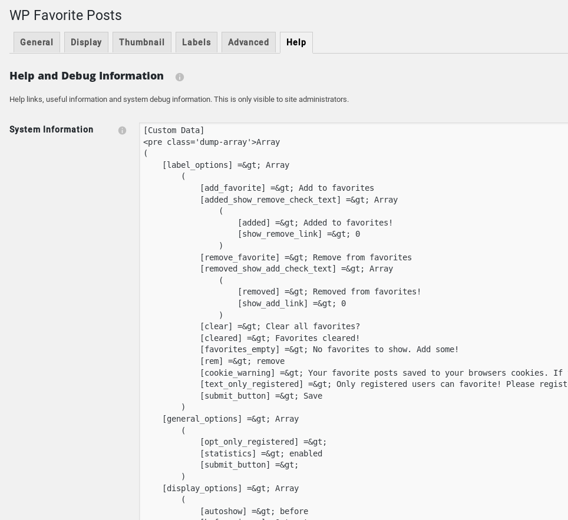
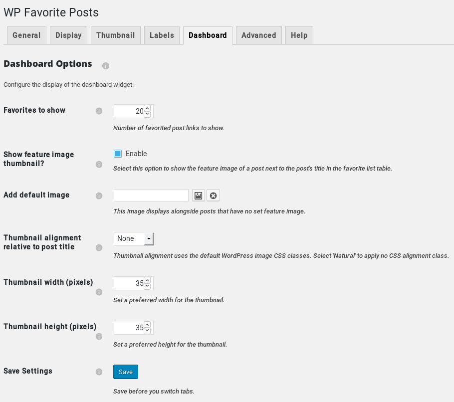
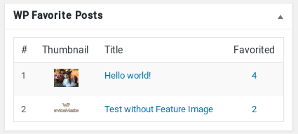

# WP Favorite Posts

Version 2.1.3

This is the forked version.

WP Favorite Posts is a WordPress plugin to enable site visitors to add posts to a favorite list.

This version (versions 1.7.1 and above): [https://github.com/vr51/wp-favorite-posts/]( http://github.com/vr51/wp-favorite-posts/)

Original version (versions at 1.x and below): [https://wordpress.org/plugins/wp-favorite-posts](http://wordpress.org/plugins/wp-favorite-posts)

* **Contributors**: [@vr51](https://github.com/vr51), [@avioli](https://github.com/avioli), [@hberberoglu](https://github.com/hberberoglu), [@mustafauysal](https://github.com/mustafauysal), [@mtedwards](https://github.com/mtedwards), [@mirkolofio](https://github.com/mirkolofio)

* **Contributing**: Contributions are more than welcome.

Please submit pull requests against versions 2.x and above to [master branch](https://github.com/vr51/wp-favorite-posts).

# Features

- Visitors can create a list of favorite posts
- Logged in visitors favorite posts are stored
- Shortcode to display visitor's favorites in a page
- Shortcode to display all favorite posts in a page
- Widget to display favorite posts
- Dashboard widget to display stats
- Display text link with or without thumbnail
- Position thumbnail relative to text link
- Set thumbnail image size (independently for dashboard widget, shortcode list(s) and sidebar widget)
- Easily configured language text for buttons and other items of display
- Translateable
- Each list display route uses its own configurable template.

# Screenshots

# Donate

Send donations to [Lee Hodson, @VR51](https://paypal.me/vr51/)
